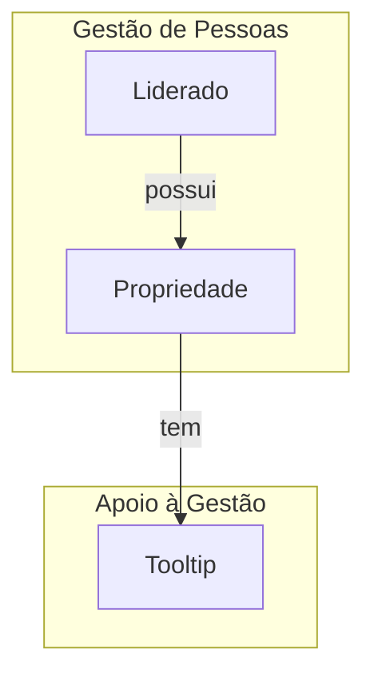
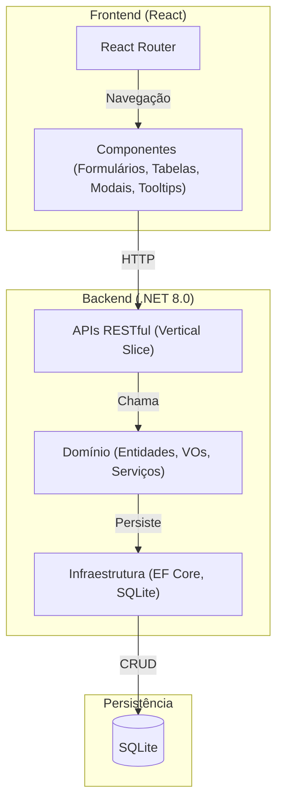
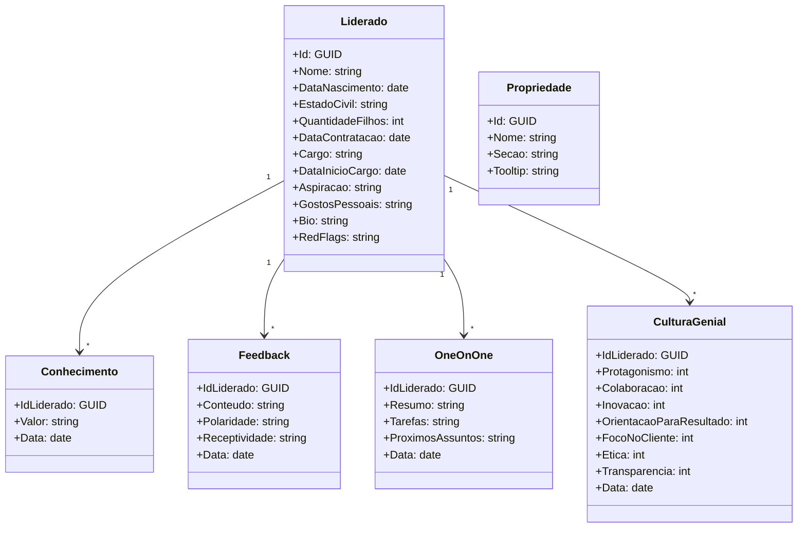
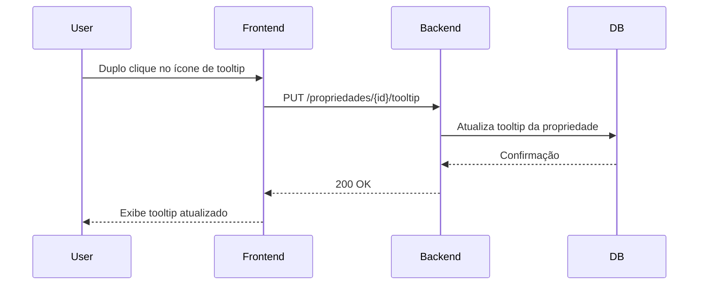
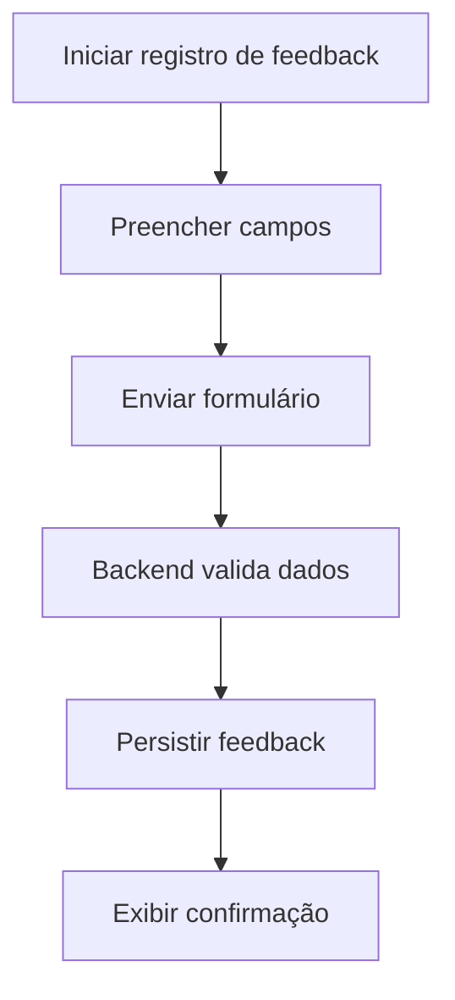
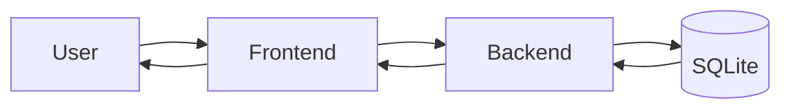

# TSD – Ferramenta de Gestão de Especialistas e Coordenadores

## Etapa 1: Architecture Haiku – Entendimento e Confirmação do Escopo

### Resumo da necessidade
Ferramenta web local para centralizar o histórico e dados estruturados de especialistas e coordenadores, facilitando o acompanhamento de desenvolvimento (PDI), feedbacks, avaliações e informações pessoais, eliminando o uso de múltiplas planilhas.

### Descrição e finalidade
O sistema permitirá ao gerente de tecnologia cadastrar, visualizar e editar informações de liderados, registrar e acompanhar PDIs, feedbacks, avaliações culturais, SWOT, perguntas exploratórias e histórico de 1:1, tudo de forma estruturada, rápida e local, sem dependência de autenticação ou multiusuário.

### Serviços de aplicação que deverão ser implementados
- Visualização consolidada (dashboard) e individual de liderados
- Registro e consulta de histórico de PDI, feedbacks, cultura, SWOT, classificações e 1:1
- Gerenciamento de tooltips
- Histórico de alterações de dados

### Principais Restrições
- Uso local, sem autenticação, multiusuário ou integração externa
- Persistência local em arquivo (SQLite)
- Foco em usabilidade, confiabilidade e desempenho
- Sem preocupações com segurança, auditoria ou observabilidade

### Ranking dos atributos de qualidade
2. Usabilidade


## Etapa 2: Especificação dos Serviços de Aplicação

| Gerenciar Dashboard                        | Exibir visão consolidada dos liderados                                   | Gestão de Pessoas                        |

| Gerenciar PDI                              | Registrar e consultar histórico de PDI                                   | Desenvolvimento Individual               |
| Gerenciar Cultura                          | Registrar avaliações culturais e exibir Radar Cultural                   | Gestão de Cultura                        |
| Gerenciar SWOT                             | Registrar e consultar análises SWOT                                      | Desenvolvimento Individual               |
| Gerenciar Classificação de Perfil          | Registrar e consultar classificação de perfil (DISC, nine box, etc.)     | Gestão de Pessoas                        |
| Gerenciar 1:1                              | Registrar e consultar histórico de reuniões 1:1                          | Desenvolvimento Individual               |
| Gerenciar Tooltips                         | Gerenciar tooltips por tipo de informação                                | Apoio à Gestão                          |

Por favor, revise a tabela acima e confirme se os serviços de aplicação estão completos e claros, ou indique ajustes necessários antes de avançarmos para a modelagem de domínio.

## Etapa 3: Mapeamento de Domínios e Limites (Domain Model + Contextos)

### Entidades Principais
- **Liderado**: representa cada especialista ou coordenador acompanhado, incluindo:
  - Dados cadastrais e biográficos: Nome, Data de Nascimento, Estado Civil, Quantidade de Filhos, Data de Contratação, Cargo, Data de Início no Cargo, Aspiração, Gostos Pessoais, BIO, Red Flags
- **Propriedade**: representa um campo/informação do liderado, com Id, Nome, Seção e Tooltip (texto explicativo associado à propriedade, exibido no frontend para orientação contextual e edição dinâmica).

### Value Objects

#### Value Objects das Propriedades do Liderado


- (Os campos Nome, Data de Nascimento, Estado Civil, Quantidade de Filhos, Data de Contratação, Cargo, Data de Início no Cargo, Aspiração, Gostos Pessoais, BIO e Red Flags são propriedades simples da entidade Liderado e não possuem histórico.)
- **Conhecimento**: { idLiderado: string, valor: string, data: date }
- **Habilidade**: { idLiderado: string, valor: string, data: date }
- **Atitude**: { idLiderado: string, valor: string, data: date }
- **Valor**: { idLiderado: string, valor: string, data: date }
- **Expectativa**: { idLiderado: string, valor: string, data: date }
- **Metas**: { idLiderado: string, valor: string, data: date }
- **Situacao Atual**: { idLiderado: string, valor: string, data: date }
- **Opcoes**: { idLiderado: string, valor: string, data: date }
- **Proximos Passos**: { idLiderado: string, valor: string, data: date }
- **DISC**: { idLiderado: string, valor: string, data: date }
- **Personalidade**: { idLiderado: string, valor: string, data: date }
- **NineBox**: { idLiderado: string, valor: string, data: date }
- **Cultura Genial**: {
  idLiderado: string,
  protagonismo: number,
  colaboracao: number,
  inovacao: number,
  orientacao_para_resultado: number,
  foco_no_cliente: number,
  etica: number,
  transparencia: number,
  data: date
}
- **Feedback**: { idLiderado: string, conteudo: string, polaridade: string, receptividade: string, data: date }
- **1:1**: { idLiderado: string, resumo: string, tarefas: string, proximos_assuntos: string, data: date }
- **Fortaleza**: { idLiderado: string, valor: string, data: date }
- **Oportunidade**: { idLiderado: string, valor: string, data: date }
- **Fraqueza**: { idLiderado: string, valor: string, data: date }
- **Ameaça**: { idLiderado: string, valor: string, data: date }
- **Fato/Observação**: { idLiderado: string, valor: string, data: date }

 Cada propriedade histórica do Liderado é representada por um Value Object, podendo ser agrupada logicamente por seção (Conhecimentos, Habilidades, Atitudes, Valores, Expectativas, Metas, Situação Atual, Opções, Próximos Passos, DISC, Personalidade, NineBox, Cultura Genial, Feedbacks, 1:1, Fortalezas, Oportunidades, Fraquezas, Ameaças, etc.).


### Agregados
- **Liderado** (root): agrega o conjunto de propriedades do liderado

### Serviços de Domínio
- Gerenciar propriedades do liderado (adicionar, editar, consultar)
- Gerenciar tooltips vinculados a propriedades

### Contextos Delimitados (Bounded Contexts)
- **Gestão de Pessoas**: Liderado, Propriedade
- **Apoio à Gestão**: Tooltips

### Diagrama de Contexto (Mermaid)


### Observações
- As seções (Informações Pessoais, CHAVE, GROW/PDI, SWOT e Perfil) são agrupadores lógicos de propriedades (Value Objects), não entidades.
- Um Liderado possui propriedades simples (sem histórico) e um conjunto de propriedades históricas (Value Objects), cada uma vinculada a uma seção lógica.
- Tooltips são vinculados a propriedades específicas, facilitando a orientação contextual no frontend.
- O histórico de alterações é inerente a cada propriedade (Value Object), não existindo um serviço global de histórico.

Por favor, revise a modelagem proposta e o diagrama de contexto. Confirma que está de acordo ou deseja sugerir ajustes antes de avançarmos para arquitetura física/lógica?


### Visão Geral
A arquitetura será orientada pelo padrão Vertical Slice no backend (.NET 8.0), React (JS/TS + Bootstrap) no frontend e persistência local em SQLite. O foco é simplicidade, performance e facilidade de manutenção, sem preocupações com autenticação, segurança ou observabilidade.

### Backend (.NET 8.0)
- **Padrão Vertical Slice**: Organização do código por feature/use case, cada slice contendo controller, handler, domínio e persistência.
- **Stateless**: Cada requisição é independente, sem estado de sessão no servidor.
- **Persistência**: SQLite local, acesso via Entity Framework Core.
- **APIs**: RESTful, endpoints organizados por feature (ex: /liderados, /propriedades, /feedbacks, etc.).
- **Sem mensageria**: Não há eventos assíncronos ou filas.
- **Sem autenticação/autorização**: Uso local, sem controle de acesso.

### Frontend (React + JS/TS + Bootstrap)
- **SPA**: Aplicação de página única, roteamento via React Router.
- **Componentização**: Componentes reutilizáveis para formulários, tabelas, modais e tooltips.
- **Integração**: Consumo das APIs REST do backend.
- **Gerenciamento de estado**: Context API ou Redux (opcional, conforme complexidade).
- **Estilo**: Bootstrap para responsividade e padronização visual.

### Integração e Execução
- **Execução local**: Backend e frontend executados localmente, comunicação via HTTP.
- **Banco de dados**: Arquivo SQLite criado e gerenciado localmente.
- **Build e execução**: Scripts para facilitar build/run de ambos os lados.

### Decisões Preliminares (ADR)
- **Vertical Slice**: Facilita manutenção e evolução incremental.
- **SQLite**: Simplicidade e portabilidade para uso local.
- **REST**: Simples, fácil de integrar e testar.
- **Sem autenticação**: Alinha com o uso pessoal/local.
- **Sem mensageria**: Não há necessidade de processamento assíncrono.

### Diagrama Lógico (Mermaid)


### Pontos em Aberto / Dúvidas
- **1. Documentação das APIs:** Será utilizada OpenAPI (Swagger) para documentação automática e interativa dos endpoints REST.
- **2. Exportação/Importação de dados:** Não há necessidade prevista.
- **3. Integrações futuras:** Não há integrações externas previstas.
- **4. Sistema operacional:** Execução local garantida em ambiente Windows 11.
- **5. Gerenciamento de estado no frontend:** Não há preferência entre Redux ou Context API; escolha será feita conforme a complexidade real do frontend.

Todas as dúvidas da etapa foram respondidas. Próximo passo: modelagem de dados (conceitual/lógico/físico) e contratos de API

## Etapa 5: Modelagem de Dados (Conceitual, Lógico e Físico)

### Visão Geral
A modelagem de dados segue o domínio definido nas etapas anteriores, refletindo as entidades, value objects e relacionamentos necessários para garantir rastreabilidade, histórico e flexibilidade.

### Tabelas Principais

- **Liderado**
  - Id: GUID (PK)
  - Nome: string
  - DataNascimento: date
  - EstadoCivil: string
  - QuantidadeFilhos: int
  - DataContratacao: date
  - Cargo: string
  - DataInicioCargo: date
  - Aspiracao: string
  - GostosPessoais: string
  - Bio: string
  - RedFlags: string

- **Propriedade**
  - Id: GUID (PK)
  - Nome: string
  - Secao: string
  - Tooltip: string

- **Conhecimento, Habilidade, Atitude, Valor, Expectativa, Metas, SituacaoAtual, Opcoes, ProximosPassos, DISC, Personalidade, NineBox, Fortaleza, Oportunidade, Fraqueza, Ameaca, FatoObservacao**
  - IdLiderado: GUID (FK)
  - Valor: string
  - Data: date

- **CulturaGenial**
  - IdLiderado: GUID (FK)
  - Protagonismo: int
  - Colaboracao: int
  - Inovacao: int
  OrientacaoParaResultado: int
  FocoNoCliente: int
  Etica: int
  Transparencia: int
  Data: date

- **Feedback**
  - IdLiderado: GUID (FK)
  - Conteudo: string
  - Polaridade: string
  - Receptividade: string
  - Data: date

- **OneOnOne**
  - IdLiderado: GUID (FK)
  - Resumo: string
  - Tarefas: string
  - ProximosAssuntos: string
  - Data: date

### Relacionamentos
- Um Liderado possui várias propriedades históricas (1:N).
- Cada registro histórico referencia o Liderado por IdLiderado (FK).
- Propriedade pode ser usada para mapear campos dinâmicos e tooltips.

### Diagrama Entidade-Relacionamento (Mermaid)

```mermaid
erDiagram
  Liderado ||--o{ Conhecimento : "possui"
  Liderado ||--o{ Habilidade : "possui"
  Liderado ||--o{ Atitude : "possui"
  Liderado ||--o{ Valor : "possui"
  Liderado ||--o{ Expectativa : "possui"
  Liderado ||--o{ Metas : "possui"
  Liderado ||--o{ SituacaoAtual : "possui"
  Liderado ||--o{ Opcoes : "possui"
  Liderado ||--o{ ProximosPassos : "possui"
  Liderado ||--o{ DISC : "possui"
  Liderado ||--o{ Personalidade : "possui"
  Liderado ||--o{ NineBox : "possui"
  Liderado ||--o{ CulturaGenial : "possui"
  Liderado ||--o{ Feedback : "possui"
  Liderado ||--o{ OneOnOne : "possui"
  Liderado ||--o{ Fortaleza : "possui"
  Liderado ||--o{ Oportunidade : "possui"
  Liderado ||--o{ Fraqueza : "possui"
  Liderado ||--o{ Ameaca : "possui"
  Liderado ||--o{ FatoObservacao : "possui"
  Liderado ||--o{ Propriedade : "possui"
  Propriedade ||--o{ Tooltip : "tem"
```


### Observações
- Todos os históricos são vinculados ao Liderado por IdLiderado.
- Propriedade serve como metadado para campos dinâmicos e tooltips.
- Tipos de dados podem ser ajustados conforme necessidade do ORM/EF Core.
- O modelo físico pode ser refinado durante a implementação, mantendo rastreabilidade e performance.

Por favor, revise a modelagem de dados e o diagrama ER. Confirma que está de acordo ou deseja sugerir ajustes antes de avançarmos para os contratos de API?

## Etapa 6: Contratos de APIs

### Visão Geral
As APIs serão RESTful, documentadas via OpenAPI (Swagger), organizadas por feature (Vertical Slice) e expostas pelo backend .NET 8.0. Todas as operações são locais, sem autenticação.

### Endpoints Principais

#### Liderados
- `GET /liderados` – Lista todos os liderados
- `GET /liderados/{id}` – Detalha um liderado
- `POST /liderados` – Cria um novo liderado
- `PUT /liderados/{id}` – Atualiza um liderado
- `DELETE /liderados/{id}` – Remove um liderado

#### Propriedades
- `GET /propriedades` – Lista todas as propriedades
- `GET /propriedades/{id}` – Detalha uma propriedade
- `POST /propriedades` – Cria uma nova propriedade
- `PUT /propriedades/{id}` – Atualiza uma propriedade
- `DELETE /propriedades/{id}` – Remove uma propriedade

#### Tooltips
- `GET /propriedades/{id}/tooltip` – Obtém o tooltip de uma propriedade
- `PUT /propriedades/{id}/tooltip` – Atualiza o tooltip de uma propriedade

#### Históricos (Value Objects)
- `GET /liderados/{idLiderado}/[vo]` – Lista o histórico de um VO (ex: /liderados/{id}/conhecimentos)
- `POST /liderados/{idLiderado}/[vo]` – Adiciona um novo registro ao histórico
- `DELETE /liderados/{idLiderado}/[vo]/{data}` – Remove um registro do histórico (por data)

#### Feedbacks e 1:1
- `GET /liderados/{idLiderado}/feedbacks` – Lista feedbacks
- `POST /liderados/{idLiderado}/feedbacks` – Adiciona feedback
- `GET /liderados/{idLiderado}/oneonones` – Lista reuniões 1:1
- `POST /liderados/{idLiderado}/oneonones` – Adiciona reunião 1:1

### Exemplos de Contratos (OpenAPI YAML)

#### Exemplo – Liderado
```yaml
get:
  summary: Lista todos os liderados
  responses:
    '200':
      description: Lista de liderados
      content:
        application/json:
          schema:
            type: array
            items:
              $ref: '#/components/schemas/Liderado'
```

#### Exemplo – Value Object (Conhecimento)
```yaml
post:
  summary: Adiciona conhecimento ao liderado
  requestBody:
    required: true
    content:
      application/json:
        schema:
          $ref: '#/components/schemas/Conhecimento'
  responses:
    '201':
      description: Conhecimento registrado
```

### Observações
- Todos os endpoints retornam status HTTP convencionais (200, 201, 204, 400, 404).
- Os contratos OpenAPI completos serão gerados automaticamente pelo backend.
- Os nomes dos endpoints seguem o padrão pluralizado e segmentado por recurso.
- Não há autenticação, paginação ou filtros avançados neste escopo.

Por favor, revise os contratos propostos. Caso queira detalhar algum endpoint, request/response ou adicionar exemplos específicos, posso complementar antes de avançar para diagramas e aspectos transversais.

---

## Etapa 7: Diagramas (Classes, Sequência, Atividade, Dados)

### Diagrama de Classes (Mermaid)


### Diagrama de Sequência – Edição de Tooltip


### Diagrama de Atividade – Registro de Feedback


### Diagrama de Fluxo de Dados


---

Esses diagramas cobrem as principais visões estruturais e de fluxo do sistema. Caso queira detalhar algum caso de uso, classe ou fluxo específico, posso complementar. Se estiver de acordo, posso avançar para aspectos transversais (segurança, performance, resiliência, etc.).

---

## Etapa 8: Aspectos Transversais (Segurança, Performance, Resiliência, Portabilidade, Manutenção)

### Segurança
- O sistema é local, sem autenticação ou autorização.
- Não há exposição de dados sensíveis externamente.
- Recomenda-se backup periódico do arquivo SQLite.
- Evitar compartilhamento do arquivo de dados sem criptografia.

### Performance
- Backend .NET 8.0 e frontend React garantem boa performance para uso local.
- Operações CRUD são rápidas devido ao uso de SQLite.
- Recomenda-se indexação adequada das tabelas para consultas.

### Resiliência
- Persistência local minimiza riscos de indisponibilidade.
- Recomenda-se implementar mecanismos de recuperação automática do arquivo SQLite em caso de corrupção.
- Backup incremental pode ser adotado para maior segurança.

### Portabilidade
- O sistema pode ser executado em qualquer máquina Windows 11.
- SQLite é multiplataforma, facilitando migração futura.
- Código fonte e scripts de build devem ser documentados para facilitar reinstalação.

### Manutenção
- Padrão Vertical Slice facilita manutenção e evolução incremental.
- Documentação clara dos endpoints e modelos de dados.
- Recomenda-se testes automatizados para garantir integridade.
- Atualizações de dependências devem ser monitoradas para evitar vulnerabilidades.

### Observações
- Não há requisitos de auditoria, observabilidade ou integração externa.
- O foco é usabilidade, confiabilidade e simplicidade.
- Caso o escopo evolua para multiusuário ou integração externa, recomenda-se revisão dos aspectos de segurança e performance.

---

## Etapa 9: Cenários de Teste

### Objetivo
Garantir que o sistema atende aos requisitos funcionais e não funcionais, cobrindo os principais fluxos, casos de uso, situações de borda e falhas.

### Cenários Funcionais
- Cadastro de liderado com todos os campos obrigatórios e opcionais.
- Edição de liderado e validação de persistência das alterações.
- Exclusão de liderado e remoção de históricos associados.
- Registro de conhecimento, feedback, 1:1 e cultura genial para um liderado.
- Consulta de históricos por liderado.
- Cadastro, edição e exclusão de propriedades e tooltips.
- Visualização consolidada (dashboard) e individual de liderados.

### Cenários de Bordas e Falhas
- Cadastro de liderado com campos obrigatórios ausentes.
- Registro de histórico com data inválida ou duplicada.
- Edição de propriedade inexistente.
- Exclusão de liderado inexistente.
- Persistência de dados após falha de energia ou fechamento abrupto.
- Recuperação do sistema após corrupção do arquivo SQLite.

### Cenários de Usabilidade
- Navegação entre telas sem perda de dados.
- Feedback visual ao usuário em operações de sucesso e erro.
- Validação de campos obrigatórios e mensagens claras.
- Performance aceitável para operações CRUD e consultas.

### Cenários de Performance
- Teste de carga com grande volume de liderados e históricos.
- Tempo de resposta para consultas e operações de escrita.
- Verificação de uso de recursos (CPU, memória) em ambiente local.

### Cenários de Portabilidade
- Execução do sistema em diferentes máquinas Windows 11.
- Migração do arquivo SQLite entre ambientes.

### Observações
- Os cenários de teste devem ser revisados e ampliados conforme evolução do sistema.
- Recomenda-se automação dos testes para garantir integridade contínua.
- Testes de borda e falha são essenciais para garantir confiabilidade.

---

## Etapa 10: Riscos técnicos e mitigação

### Principais riscos técnicos
- Corruptibilidade do arquivo SQLite: Possibilidade de perda de dados por corrupção ou falha de energia.
- Ausência de autenticação: Uso local sem controle de acesso pode expor dados sensíveis se o arquivo for compartilhado.
- Dependência de ambiente Windows: Portabilidade limitada caso haja necessidade de migração para outros sistemas operacionais.
- Evolução de requisitos: Mudanças futuras podem exigir refatoração significativa, especialmente para multiusuário ou integração externa.
- Atualização de dependências: Risco de incompatibilidade ou vulnerabilidades em bibliotecas/frameworks.
- Backup insuficiente: Falta de rotina de backup pode resultar em perda irreversível de dados.
- Performance em grande volume: SQLite pode apresentar lentidão com volumes muito altos de dados.

### Estratégias de mitigação
- Implementar rotina de backup automático e orientações para backup manual.
- Documentar claramente os riscos de compartilhamento do arquivo de dados.
- Monitorar e testar atualizações de dependências antes de aplicar em produção.
- Planejar migração gradual caso haja necessidade de portabilidade para outros sistemas.
- Adotar testes automatizados para garantir integridade após mudanças.
- Orientar sobre práticas de recuperação de arquivo SQLite.
- Definir limites de uso e recomendações para volumes de dados.

---

## Etapa 11: Checklist final de prontidão para desenvolvimento

### Checklist
- [ ] Escopo e requisitos validados com stakeholders
- [ ] Modelagem de domínio revisada e aprovada
- [ ] Diagramas (classes, sequência, atividade, dados) completos e alinhados ao domínio
- [ ] Modelagem de dados (ER) validada
- [ ] Contratos de API definidos e documentados
- [ ] Aspectos transversais (segurança, performance, resiliência, portabilidade, manutenção) revisados
- [ ] Cenários de teste definidos e abrangentes
- [ ] Referências e bibliografia registradas
- [ ] Riscos técnicos identificados e estratégias de mitigação planejadas
- [ ] Scripts de build e execução preparados
- [ ] Documentação de instalação e uso pronta
- [ ] Checklist revisado por equipe técnica

---

Essas etapas garantem que o projeto está pronto para iniciar o desenvolvimento, minimizando riscos e alinhando expectativas.
